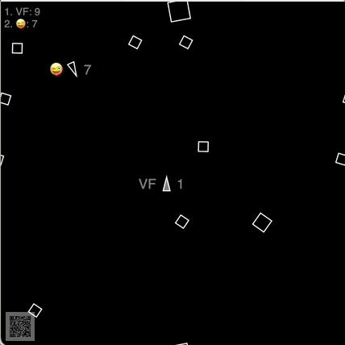

# Croquet Multiblaster Tutorial



_[CLICK HERE TO PLAY](https://croquet.github.io/multiblaster-tutorial/step9.html) – then scan the QR code or share the generated session URL to invite other players._

Each HTML file in [this repository](https://github.com/croquet/multiblaster-tutorial/)
contains an increasingly complete multiplayer game built using [Croquet](https://croquet.io/docs/).

It's a 2D game, and its visuals are intentionally kept simple so that the code is more understandable.

The game has asteroids and ships floating in space.
If an objects goes beyond the screen edge, it comes back in on the other side.
Players steer their ships by firing thrusters (left, right and forward).
They can also shoot blasts which cause asteroids to break up and vanish.
Successful blasts increase the player's score, while colliding with an asteroid
causes a ship to be destroyed and lose all points.

## Step 0: Asteroids floating without Croquet

([full source code](https://github.com/croquet/multiblaster-tutorial/blob/main/step0.html))
([run it](https://croquet.github.io/multiblaster-tutorial/step0.html))

This is a non-Croquet app. It shows a few asteroids floating through space.
If you run this in two windows, the asteroids will float differently.

Each asteroid has an `x` and `y` position as well as an `a` angle.
Additionally, it has `dx`, `dy` and `da` properties which represent the
amount to change the position and angle in every time step to
animate the object in its `move()` method:

```js
move() {
    this.x = (this.x + this.dx + 1000) % 1000;
    this.y = (this.y + this.dy + 1000) % 1000;
    this.a = (this.a + this.da + Math.PI) % Math.PI;
    setTimeout(() => this.move(), 50);
}
```
The movement is restricted to the playfield's size (0 to 1000) using remainder math (the `%` operator).
This causes the asteroid to come back in on the other side when it floats out.

The playfield is a 1000⨉1000 canvas scaled to fit in the window.
Asteroids are drawn using plain white strokes in the `update()` function:

```js
for (const asteroid of asteroids) {
    const {x, y, a} = asteroid;
    context.save();
    context.translate(x, y);
    context.rotate(a);
    context.beginPath();
    context.moveTo(+40,  0);
    context.lineTo( 0, +40);
    context.lineTo(-40,  0);
    context.lineTo( 0, -40);
    context.closePath();
    context.stroke();
    context.restore();
}
```

This file has about 80 lines of code total.

## Step 1: Asteroids synchronized with Croquet

([full source code](https://github.com/croquet/multiblaster-tutorial/blob/main/step1.html))
([run it](https://croquet.github.io/multiblaster-tutorial/step1.html))

This is the same app, but using a Croquet Model for the asteroids.

A session name and password is automatically appended to the URL.
If you open that session URL in another window or on another device,
the asteroids will float exactly the same in both.

The app is devided into two parts: The "model" is the part that is synchronized
by Croquet for all users. It is like a shared computer that all users directly
interact with. The other part is the "view", which displays the model to the user
by drawing the asteroids on a canvas.

The last few lines instruct Croquet to join a session for a particular model and view class.
It also needs an API key. You should fetch your own key from https://croquet.io/keys

This version has only 20 lines more than the non-Croquet one from step 0.

Notice that the computation looks exactly the same, no special data structures need to be used,
all models are synchronized between machines without any special markup.

```js
move() {
    this.x = (this.x + this.dx + 1000) % 1000;
    this.y = (this.y + this.dy + 1000) % 1000;
    this.a = (this.a + this.da + Math.PI) % Math.PI;
    this.future(50).move();
}
```

The only new construct is the line
```js
this.future(50).move();
```
inside of the `move()` method. This causes `move()` to be called again 50 ms in the future,
similarly to the `timeout()` call in step 0. Future messages are how you define an object's behavior over
time in Croquet.

Drawing happens exactly the same as in the non-Croquet case:

```js
for (const asteroid of this.model.asteroids) {
    const { x, y, a, size } = asteroid;
    this.context.save();
    this.context.translate(x, y);
    this.context.rotate(a);
    this.context.beginPath();
    this.context.moveTo(+size,  0);
    this.context.lineTo( 0, +size);
    this.context.lineTo(-size,  0);
    this.context.lineTo( 0, -size);
    this.context.closePath();
    this.context.stroke();
    this.context.restore();
}
```

Notice that the view's `update()` method can read the asteroid positions directly from the model
for drawing. Unlike in server-client computing, these positions do not need to be transmitted
via the network. They are already available locally.

However, you must take care to not accidentally modify any model properties directly,
because that would break the synchronization. See the next step for how to interact with the model.

## Step 2: Spaceships controlled by players

([full source code](https://github.com/croquet/multiblaster-tutorial/blob/main/step2.html))
([run it](https://croquet.github.io/multiblaster-tutorial/step2.html))

This step adds interactive space ships.

For each player joining, another spaceship is created by subscribing to the session's
`view-join` and `view-exit` events:

```js
    init() {
        ...
        this.ships = new Map();
        this.subscribe(this.sessionId, "view-join", this.viewJoined);
        this.subscribe(this.sessionId, "view-exit", this.viewExited);
    }

    viewJoined(viewId) {
        const ship = Ship.create({ viewId });
        this.ships.set(viewId, ship);
    }

    viewExited(viewId) {
        const ship = this.ships.get(viewId);
        this.ships.delete(viewId);
        ship.destroy();
    }
```
Each ship subscribes to that player's input only, using the player's `viewId` as an event scope.
This is how the shared model can distinguish events sent from different user's views:

```js
init({ viewId }) {
    ...
    this.left = false;
    this.right = false;
    this.forward = false;
    this.subscribe(viewId, "left-thruster", this.leftThruster);
    this.subscribe(viewId, "right-thruster", this.rightThruster);
    this.subscribe(viewId, "forward-thruster", this.forwardThruster);
    this.move();
}

leftThruster(active) {
    this.left = active;
}

rightThruster(active) {
    this.right = active;
}

forwardThruster(active) {
    this.forward = active;
}
```

The ship's `move()` method uses the stored thruster values to accelerate or rotate the ship:

```js
move() {
    if (this.forward) this.accelerate(0.5);
    if (this.left) this.a -= 0.2;
    if (this.right) this.a += 0.2;
    ...
}
```

In the local view, key up and down events of the arrow keys publish the events to enable and disable the thrusters:

```js
document.onkeydown = (e) => {
    if (e.repeat) return;
    switch (e.key) {
        case "ArrowLeft":  this.publish(this.viewId, "left-thruster", true); break;
        case "ArrowRight": this.publish(this.viewId, "right-thruster", true); break;
        case "ArrowUp":    this.publish(this.viewId, "forward-thruster", true); break;
    }
};
document.onkeyup = (e) => {
    if (e.repeat) return;
    switch (e.key) {
        case "ArrowLeft":  this.publish(this.viewId, "left-thruster", false); break;
        case "ArrowRight": this.publish(this.viewId, "right-thruster", false); break;
        case "ArrowUp":    this.publish(this.viewId, "forward-thruster", false); break;
    }
};
```

In Croquet, publish and subscribe are used mainly to communicate events from the user's view to the shared model,
typically derived from user input. Unlike in other pub/sub systems you may be familiar with,
Croquet's pub/sub is not used to synchronize changed values or to communicate between different devices.
All communication is only between the local view and the shared model.

Before joining the session, `makeWidgetDock()` enables a QR code widget in the lower left corner.
This allows you to join the same session not only by copying the session URL but also by scanning
this code with a mobile device.

## Step 3: Firing a blaster

([full source code](https://github.com/croquet/multiblaster-tutorial/blob/main/step3.html))
([run it](https://croquet.github.io/multiblaster-tutorial/step3.html))

When pressing the space bar, a `"fire-blaster"` event is published.
The ship subscribes to that event and creates a new blast that
moves in the direction of the ship:

```js
fireBlaster() {
    const dx = Math.cos(this.a) * 20;
    const dy = Math.sin(this.a) * 20;
    const x = this.x + dx;
    const y = this.y + dy;
    Blast.create({ x, y, dx, dy });
}
```

The blast registers itself with the game object when created,
and removes itself when destroyed. This is accomplished by
accessing the `Game` as the well-known `modelRoot`.

```js
get game() { return this.wellKnownModel("modelRoot"); }
```

The blast destroys itself after a while
by counting its `t` property up in every move step:

```js
move() {
    this.t++;
    if (this.t > 30) {
        this.destroy();
        return;
    }
    ...
}
```

## Step 4: Break up asteroids when hit by blasts

([full source code](https://github.com/croquet/multiblaster-tutorial/blob/main/step4.html))
([run it](https://croquet.github.io/multiblaster-tutorial/step4.html))

In this step the we add collision detection between the blasts and the asteroids.
When hit, Asteroids split into two smaller chunks, or are destroyed completely.

To make this simpler, the individual future messages are now replaced by a single `mainLoop()`
method which calls all `move()` methods and then checks for collisions:

```js
mainLoop() {
    for (const ship of this.ships.values()) ship.move();
    for (const asteroid of this.asteroids) asteroid.move();
    for (const blast of this.blasts) blast.move();
    this.checkCollisions();
    this.future(50).mainLoop();
}
```

When an asteroid was hit by a blast, it shrinks itself and changes direction perpendicular to the shot.
Also it creates another asteroid that goes into the opposite direction. This makes it appear as if
the asteroid broke into two pieces:

```js
hitBy(blast) {
    if (this.size > 20) {
        this.size *= 0.7;
        this.da *= 1.5;
        this.dx = -blast.dy * 10 / this.size;
        this.dy = blast.dx * 10 / this.size;
        Asteroid.create({ size: this.size, x: this.x, y: this.y, a: this.a, dx: -this.dx, dy: -this.dy, da: this.da });
    } else {
        this.destroy();
    }
    blast.destroy();
}
```

## Step 5: Turn ship into debris after colliding with asteroids

([full source code](https://github.com/croquet/multiblaster-tutorial/blob/main/step5.html))
([run it](https://croquet.github.io/multiblaster-tutorial/step5.html))

Now we add collision between ships and asteroids, and turn both into debris which is floating for a while.

We do this by adding a `wasHit` property that normally is `0`, but gets set to `1` when hit.
It then starts counting up for each `move()` step just like the `t` property in the blast,
and after a certain number of steps destroys the asteroid and resets the ship:

```js
move() {
    if (this.wasHit) {
        // keep drifting as debris for 3 seconds
        if (++this.wasHit > 60) this.reset();
    } else {
        // process thruster controls
        if (this.forward) this.accelerate(0.5);
        if (this.left) this.a -= 0.2;
        if (this.right) this.a += 0.2;
    }
    ...
}
```

Also, while the ship's `wasHit` is non-zero, its `move()` method ignores the thruster controls,
and the blaster cannot be fired. This forces the player to wait until the ship is reset to the
center of the screen.

The drawing code in the view's `update()` takes the `wasHit` property to show an exploded
version of the asteroid or ship. Since `wasHit` is incremented in every move step,
it determines the distance of each line segment to its original location:

```js
if (!wasHit) {
    this.context.moveTo(+20,   0);
    this.context.lineTo(-20, +10);
    this.context.lineTo(-20, -10);
    this.context.closePath();
} else {
    const t = wasHit;
    this.context.moveTo(+20 + t,   0 + t);
    this.context.lineTo(-20 + t, +10 + t);
    this.context.moveTo(-20 - t * 1.4, +10);
    this.context.lineTo(-20 - t * 1.4, -10);
    this.context.moveTo(-20 + t, -10 - t);
    this.context.lineTo(+20 + t,   0 - t);
}
```

## Step 6: Score points when hitting an asteroid with a blast

([full source code](https://github.com/croquet/multiblaster-tutorial/blob/main/step6.html))
([run it](https://croquet.github.io/multiblaster-tutorial/step6.html))

Add scoring for ships hitting an asteroid.
When a blast is fired, we store a reference to the ship in the blast.

```js
fireBlaster() {
    ...
    Blast.create({ x, y, dx, dy, ship: this });
}
```

When the blast hits an asteroid, the ship's `scored()` method is called, which increments its `score`:

```js
hitBy(blast) {
    blast.ship.scored();
    ...
}
```

The `update()` method displays each ship's score next to the ship.
Also, to better distinguish our own ship, we draw it filled.
We find our own ship by comparing its `viewId` to the local `viewId`:

```js
update() {
    ...
    this.context.fillText(score, 30 - wasHit * 2, 0);
    ...
    if (viewId === this.viewId) this.context.fill();
    ...
}
```

## Step 7: View-side animation smoothing

([full source code](https://github.com/croquet/multiblaster-tutorial/blob/main/step7.html))
([run it](https://croquet.github.io/multiblaster-tutorial/step7.html))

Add render smoothing for 60 fps animation. The models move at 20 fps (because of the 50 ms future send
in the main loop) but for smooth animation you typically want to animate at a higher fps.
While we could increase the model update rate, that would make the timing depend very much
on the steadiness of ticks from the reflector.
Instead, we do automatic in-betweening in the view by decoupling the rendering position from the
model position, and updating the render position "smoothly."

This step uses the exact same model code as in step 7, so you can actually run
both side-by-side with the same session name and password to see the difference.

## Step 8: Persistent table of highscores

([full source code](https://github.com/croquet/multiblaster-tutorial/blob/main/step8.html))
([run it](https://croquet.github.io/multiblaster-tutorial/step8.html))

Add persistent highscore.

This step adds a text input field for players' initials (or an emoji).
Its value is kept in `localStorage` so players only have to type it once.

A highscore table is added to the model, and persisted using `persistSession()` call.
Persisting means that the important session contents survives even if the model code changes,
which normally means it starts from scratch. If persisted data exists for a session that uses
the same name but new code, it will be passed into the root model's `init()` method.

## Step 9: Support for mobile etc.

([full source code](https://github.com/croquet/multiblaster-tutorial/blob/main/step9.html))
([run it](https://croquet.github.io/multiblaster-tutorial/step9.html))

This is the finished tutorial game. It has some more features, like
* support for mobile devices via touch input
* ASDW keys in addition to arrow keys
* visible thrusters
* "wrapped" drawing so that objects are half-visible on both sides when crossing the screen edge
* prevents ships getting destroyed by an asteroid in the spawn position
* etc.

## Advanced Game

There's an even more polished game with some gimmicks at
https://github.com/croquet/multiblaster/

One of its gimmicks is that if the initials contain an emoji, it will be used for shooting. The trickiest part of that is properly parsing out the emoji, which can be composed of many code points 😉

You can play it online at https://croquet.io/multiblaster/